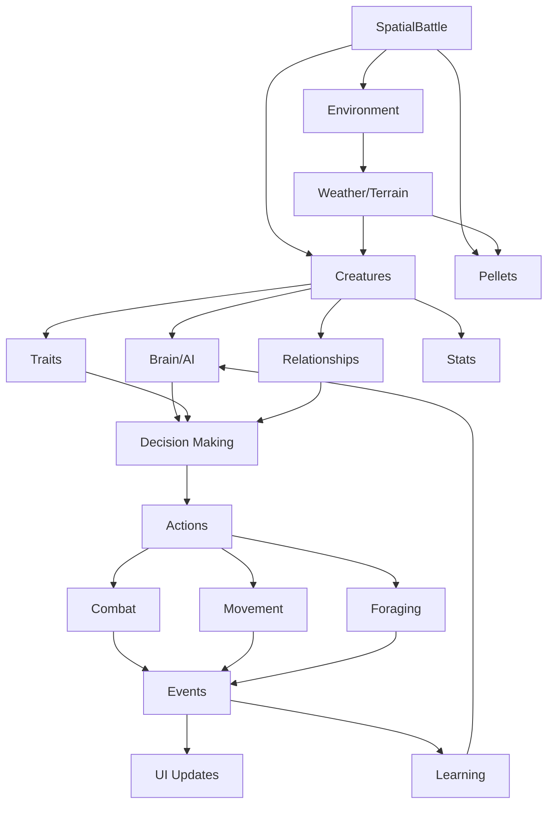

# EvoBattle Systems Architecture
**Complete Guide to All Working Features and System Interactions**

> **Last Updated:** 2025-11-25  
> **Purpose:** Master reference document explaining how all EvoBattle systems work together

---

## Table of Contents

1. [System Overview](#system-overview)
2. [Core Systems](#core-systems)
3. [Creature Systems](#creature-systems)
4. [Environmental Systems](#environmental-systems)
5. [Learning & Evolution](#learning--evolution)
6. [Combat & Behavior](#combat--behavior)
7. [UI & Visualization](#ui--visualization)
8. [System Interaction Map](#system-interaction-map)

---

## System Overview

EvoBattle is a complex evolutionary simulation with multiple interconnected systems. This document explains how each system works and how they interact with each other.

### Architecture Layers

```
┌─────────────────────────────────────────────────────────┐
│  PRESENTATION LAYER (UI & Rendering)                    │
│  - Pygame rendering, UI panels, creature inspector      │
└────────────────┬────────────────────────────────────────┘
                 │
┌────────────────▼────────────────────────────────────────┐
│  SIMULATION LAYER (Battle & World Systems)              │
│  - SpatialBattle, Environment, Disease, Breeding        │
└────────────────┬────────────────────────────────────────┘
                 │
┌────────────────▼────────────────────────────────────────┐
│  ENTITY LAYER (Creatures, Pellets, Structures)          │
│  - Creature stats, brains, traits, relationships        │
└────────────────┬────────────────────────────────────────┘
                 │
┌────────────────▼────────────────────────────────────────┐
│  FOUNDATION LAYER (Core Models & Utilities)             │
│  - Stats, Spatial, Vector2D, Events                     │
└─────────────────────────────────────────────────────────┘
```

---

## Core Systems

### 1. Spatial Battle System
**File:** `src/systems/battle_spatial.py`

The central simulation engine that orchestrates all other systems.

**Key Responsibilities:**
- Update loop coordination (60 FPS)
- Creature lifecycle management
- Combat resolution
- Resource spawning
- Event emission

**Update Cycle:**
```python
def update(delta_time):
    1. Update environment (weather, hazards)
    2. Tick hunger and age for all creatures
    3. Apply environmental damage
    4. Update creature AI (staggered batches)
    5. Update physics and movement
    6. Check pellet collection
    7. Check breeding opportunities
    8. Update learning systems
    9. Process status effects
```

**Performance Optimizations:**
- Staggered AI updates (1/4 creatures per frame)
- Intelligent creatures update every frame
- Spatial grid for efficient neighbor queries
- Separation forces calculated every 2 frames

---

### 2. Creature Model
**File:** `src/models/creature.py`

The fundamental entity representing a living creature.

**Core Attributes:**
```python
class Creature:
    # Identity
    creature_id: str
    name: str
    strain_id: str  # Genetic family
    
    # Stats & Combat
    stats: Stats  # HP, attack, defense, speed
    abilities: List[Ability]
    traits: List[Trait]
    
    # Survival
    hunger: float  # 0-100
    energy: int
    age: float
    mature: bool
    
    # Systems
    brain: NeuralBrain  # Learning system
    personality: PersonalityProfile
    relationships: RelationshipManager
    history: CreatureHistory
    skills: SkillManager
    
    # Disease & Injury
    active_infection: Optional[Infection]
    injury_tracker: InjuryTracker
    hazard_memories: List[HazardMemory]
```

**Key Methods:**
- `has_trait(name)` - Check for genetic trait
- `eat(food_value, food_type)` - Consume food
- `tick_hunger(delta_time)` - Deplete hunger
- `can_breed()` - Check breeding eligibility

---

### 3. Stats System
**File:** `src/models/stats.py`

Manages creature statistics with modifiers.

**Stat Types:**
- **HP** (Health Points) - Creature's life
- **Attack** - Damage dealt
- **Defense** - Damage reduction
- **Speed** - Turn order & movement

**Modifier System:**
```python
class StatModifier:
    name: str
    duration: float  # -1 = permanent
    attack_multiplier: float  # 1.0 = no change
    defense_multiplier: float
    speed_multiplier: float
```

**Calculation Flow:**
```
Base Stats (from CreatureType)
    ↓
+ Trait Modifiers (genetic)
    ↓
+ Active Modifiers (buffs/debuffs)
    ↓
= Effective Stats (used in combat)
```

---

## Creature Systems

### 4. Genetic Traits System
**Files:** 
- `src/models/trait.py` - Base trait model
- `src/models/ecosystem_traits.py` - Survival traits
- `src/models/environmental_traits.py` - Environment traits
- `src/models/expanded_traits.py` - Combat traits

**Trait Categories:**

**A. Metabolic Traits** (Hunger & Energy)
- `Efficient Metabolism` - 40% slower hunger
- `Glutton` - 50% faster hunger, bonus HP when eating
- `Voracious` - 40% faster hunger, HP bonus
- `Indiscriminate Eater` - Eats anything, 50% toxicity resistance

**B. Dietary Traits** (Food Restrictions)
- `Carnivore` - Only eats meat
- `Herbivore` - Only eats plants
- `Picky Eater` - Refuses low-quality food, bonus from quality food

**C. Behavioral Traits** (AI Priorities)
- `Forager` - Prioritizes food seeking
- `Social` - Stays near allies
- `Patroller` - Explores territory
- `Playful` - Random wandering

**D. Combat Traits** (Battle Bonuses)
- `Berserker` - Damage increases as HP drops
- `Executioner` - Bonus damage to low-HP enemies
- `Assassin` - High crit chance
- `Vampiric` - Lifesteal on attacks

**E. Environmental Traits** (Adaptation)
- `Aquatic` - 2x speed in water
- `Desert Adapted` - Heat resistance
- `Fire Proof` - Hazard immunity
- `Nocturnal` - Night vision bonus

**F. Learning Traits** (Intelligence)
- `Intelligent` - Neural brain, observational learning

**Trait Inheritance:**
```python
# Breeding combines parent traits
child_traits = breeding_system.combine_traits(
    parent1.traits,
    parent2.traits,
    mutation_rate=0.1
)

# Mutations can:
# - Add new traits (10% chance)
# - Remove traits (5% chance)
# - Modify trait strength (±20%)
```

---

### 5. Neural Brain System
**File:** `src/models/creature_brain.py`

Creatures with the `Intelligent` trait get a neural network for decision-making.

**Architecture:**
```
5 Inputs → 3 Hidden Neurons → 4 Outputs

Inputs:
  0: Hunger level (0-1)
  1: Nearest threat distance (0-1, closer = higher)
  2: Nearest food distance (0-1, closer = higher)
  3: HP ratio (0-1)
  4: Ally count nearby (0-1)

Outputs:
  0: EAT score
  1: FLEE score
  2: FIGHT score
  3: EXPLORE score
```

**Learning Mechanisms:**

**A. Reinforcement Learning** (Individual Experience)
```python
# Positive rewards
creature.brain.apply_reward(+1.0)  # Ate food
creature.brain.apply_reward(+1.5)  # Killed enemy

# Negative rewards
creature.brain.apply_reward(-0.5)  # Took damage
creature.brain.apply_reward(-1.0)  # Starving
```

**B. Observational Learning** (Social Learning)
```python
# Intelligent creatures copy successful neighbors
if creature.has_trait("Intelligent"):
    nearby_successful = find_successful_creatures()
    creature.brain.copy_from(
        successful_creature.brain,
        blend_factor=0.05  # Copy 5% of weights
    )
```

**C. Genetic Inheritance** (Evolution)
```python
# Offspring inherit blended parent brains
child.brain.inherit_from_parents(parent1.brain, parent2.brain)
# Adds small mutation (±10%)
child.brain.mutate(mutation_rate=0.1)
```

**Learning Rate Decay:**
- Young creatures: 0.3 (learn fast)
- Mature creatures: 0.1 (set in their ways)
- Decays over 60 seconds of age

---

### 6. Trait-Brain Interaction

**How Genetic Traits and Learned Behaviors Mix:**

```
┌─────────────────────────────────────┐
│  GENETIC TRAITS (Base Layer)       │
│  - Set stat multipliers             │
│  - Define dietary restrictions      │
│  - Modify attention priorities      │
└──────────────┬──────────────────────┘
               │
               ▼
┌─────────────────────────────────────┐
│  DECISION SYSTEM (Middle Layer)     │
│                                     │
│  IF has "Intelligent" trait:        │
│    ├─► Neural Brain decides action  │
│    └─► Learns from rewards          │
│  ELSE:                              │
│    └─► Traditional AI (attention)   │
└──────────────┬──────────────────────┘
               │
               ▼
┌─────────────────────────────────────┐
│  EXECUTION (Top Layer)              │
│  - Traits filter/modify actions     │
│  - e.g., Carnivore refuses plants   │
│  - e.g., Forager boosts food search │
└─────────────────────────────────────┘
```

**Example Flow:**

1. **Hungry Intelligent Carnivore**:
   - `Carnivore` trait: Can't eat plants (genetic filter)
   - `Intelligent` trait: Has neural brain
   - Brain sees: high hunger, nearby meat pellet
   - Brain decides: "EAT" action (learned preference)
   - Execution: Moves to meat pellet, eats it
   - Reward: +1.0 (brain learns this was good)

2. **Learning Over Generations**:
   - Gen 1: Random brain, tries eating toxic food → gets hurt → learns to avoid
   - Gen 2: Inherits parent's "avoid toxic food" weights
   - Gen 3: Watches successful Gen 2 creature → copies their strategy
   - Gen 4: Has accumulated wisdom from 3 generations + own experience

**Key Advantages:**
- ✅ Traits provide stability (won't learn incompatible behaviors)
- ✅ Brains provide adaptability (learn optimal strategies)
- ✅ Observational learning accelerates evolution
- ✅ Inheritance preserves knowledge across generations
- ✅ Mutation enables innovation

---

### 7. Attention System
**File:** `src/models/attention.py`

Manages creature focus and decision priorities (for non-Intelligent creatures).

**Stimulus Types:**
```python
class StimulusType(Enum):
    FORAGING = "foraging"
    COMBAT = "combat"
    FLEEING = "fleeing"
    SOCIAL = "social"
    EXPLORING = "exploring"
    HAZARD_AVOIDANCE = "hazard_avoidance"
    IDLE = "idle"
```

**Priority Calculation:**
```python
# Each stimulus has base priority + urgency modifier
priority = base_priority * urgency_modifier * trait_modifier

# Example: Foraging priority
if hunger < 20:  # Critical
    urgency = 3.0
elif hunger < 35:  # High
    urgency = 2.0
elif hunger < 60:  # Moderate
    urgency = 1.3
else:  # Low
    urgency = 0.5

if has_trait("Forager"):
    trait_modifier = 1.5  # 50% boost
```

**Focus Commitment:**
- Creatures commit to a focus for 2-5 seconds
- Prevents rapid switching (more realistic behavior)
- Can be interrupted by critical stimuli (low HP, starvation)

---

### 8. Relationship System
**File:** `src/models/relationships.py`

Tracks social bonds between creatures.

**Relationship Types:**
```python
class RelationshipType(Enum):
    PARENT = "parent"
    CHILD = "child"
    SIBLING = "sibling"
    ALLY = "ally"
    RIVAL = "rival"
    REVENGE_TARGET = "revenge_target"
    FRIEND = "friend"
```

**Relationship Effects:**
- **Family bonds** - Protect injured relatives (1.8x combat priority)
- **Revenge** - Prioritize killing creature that killed family (1.5x priority)
- **Allies** - Avoid attacking, join fights together
- **Rivals** - Increased aggression

**Formation:**
```python
# Automatic family relationships
on_birth(child, parent1, parent2):
    child.relationships.add(parent1, PARENT)
    child.relationships.add(parent2, PARENT)
    parent1.relationships.add(child, CHILD)
    parent2.relationships.add(child, CHILD)

# Revenge relationships
on_death(victim, killer):
    for family_member in victim.get_family():
        family_member.relationships.add(killer, REVENGE_TARGET)
```

---

## Environmental Systems

### 9. Environment System
**File:** `src/models/environment.py`

Manages weather, terrain, day/night cycle, and hazards.

**Components:**

**A. Weather System**
```python
class WeatherType(Enum):
    CLEAR = "clear"
    RAINY = "rainy"
    STORMY = "stormy"
    FOGGY = "foggy"
    DROUGHT = "drought"
```

**Effects:**
- **Hunger modifier**: 0.8x (rainy) to 1.4x (drought)
- **Movement modifier**: 0.7x (stormy) to 1.0x (clear)
- **Resource spawn**: Boosted in rain, reduced in drought

**B. Terrain System**
```python
class TerrainType(Enum):
    GRASS = "grass"      # 1.0x speed
    ROCKY = "rocky"      # 0.7x speed
    WATER = "water"      # 0.3x speed (2.0x if Aquatic)
    FOREST = "forest"    # 0.8x speed
    DESERT = "desert"    # 0.9x speed
    MARSH = "marsh"      # 0.5x speed
```

**Terrain Grid:**
- Arena divided into cells (default: 10x10 units)
- Each cell has terrain type
- Creatures get speed modifier based on current terrain
- Traits can override (e.g., Aquatic, Desert Adapted)

**C. Day/Night Cycle**
```python
class TimeOfDay(Enum):
    DAWN = "dawn"    # 06:00-09:00
    DAY = "day"      # 09:00-18:00
    DUSK = "dusk"    # 18:00-21:00
    NIGHT = "night"  # 21:00-06:00
```

**Effects:**
- **Visibility**: Reduced at night (affects targeting)
- **Activity**: Nocturnal trait gets bonuses at night
- **Diurnal trait**: Bonuses during day

**D. Hazard System**
```python
class HazardType(Enum):
    FIRE = "fire"           # 5 damage/sec
    POISON_GAS = "poison"   # 3 damage/sec + poison status
    QUICKSAND = "quicksand" # 2 damage/sec + slow
    THORNS = "thorns"       # 4 damage on entry
    ELECTRICAL = "electric" # 6 damage/sec
```

**Hazard Properties:**
- Position and radius
- Damage per second
- Duration (can be permanent)
- Trait-based resistance (Fire Proof, Poison Resistant)

---

### 10. Disease System
**File:** `src/systems/disease_system.py`

Simulates disease transmission and progression.

**Disease Types:**
```python
class DiseaseType(Enum):
    PLAGUE = "plague"           # High mortality, fast spread
    WASTING = "wasting"         # Stat drain
    PARASITE = "parasite"       # Energy drain
    BLIGHT = "blight"           # Kills pellets
    TOXIN_BLOOM = "toxin_bloom" # Makes pellets toxic
```

**Infection Stages:**
```python
class InfectionStage(Enum):
    INCUBATING = "incubating"   # No symptoms, contagious
    SYMPTOMATIC = "symptomatic" # Effects active, high contagion
    RECOVERING = "recovering"   # Effects fading
    IMMUNE = "immune"           # Recovered, immune
```

**Disease Properties:**
```python
class Disease:
    contagion_radius: float      # Transmission range
    transmission_rate: float     # Chance per second
    incubation_time: float       # Time before symptoms
    duration: float              # How long it lasts
    mortality_rate: float        # Death chance
    hp_drain_rate: float         # HP lost per second
    stat_penalty: float          # % stat reduction
    mutation_chance: float       # Chance to mutate on spread
    generation: int              # Evolution generation
```

**Transmission:**
```python
# Check nearby creatures
for creature in nearby:
    if distance < disease.contagion_radius:
        if random() < disease.transmission_rate * delta_time:
            # Transmit (possibly mutated)
            if random() < disease.mutation_chance:
                new_disease = disease.mutate()
            else:
                new_disease = disease
            creature.active_infection = Infection(new_disease)
```

**Disease Evolution:**
- Diseases mutate when transmitted
- Stats change by ±20% (transmission, mortality, etc.)
- Generation number increments
- Name updates: "Red Plague (Gen 3)"

---

### 11. Pellet Ecosystem
**File:** `src/models/pellet.py`

Food resources with genetics and reproduction.

**Pellet Properties:**
```python
class Pellet:
    strain_id: str           # Genetic family
    generation: int          # Reproduction generation
    age: float              # Time alive
    
    # Nutrition
    food_value: int         # Hunger restored
    
    # Quality traits
    traits: PelletTraits
        toxicity: float     # 0.0-1.0 (higher = toxic)
        palatability: float # 0.0-1.0 (higher = tasty)
        size: float         # Visual size
    
    # Lifecycle
    max_age: float          # Lifespan
    reproduction_cooldown: float
```

**Reproduction System:**
```python
# Pellets reproduce when mature
if pellet.age > 10.0:  # Mature
    if time_since_last_reproduction > cooldown:
        # Spawn offspring nearby
        offspring = pellet.reproduce()
        offspring.traits = mutate(pellet.traits)
        offspring.generation = pellet.generation + 1
```

**Grass Growth Enhancements:**
- **Nutrient zones**: Faster growth where creatures died
- **Pollination**: Creatures spread seeds as they move
- **Growth pulses**: Periodic environmental boosts
- **Symbiotic bonus**: Herbivores enhance nearby growth

---

### 12. Breeding System
**File:** `src/systems/breeding.py`

Manages creature reproduction and genetic inheritance.

**Breeding Requirements:**
```python
def can_breed(creature):
    return (
        creature.mature and          # Age >= 20 seconds
        creature.is_alive() and
        creature.hp > 0.2 * max_hp and
        creature.hunger > 50
    )
```

**Breeding Process:**
```python
def breed(parent1, parent2):
    # 1. Create offspring
    child = Creature(name=generate_name())
    
    # 2. Inherit traits
    child.traits = combine_traits(
        parent1.traits,
        parent2.traits,
        mutation_rate=0.1
    )
    
    # 3. Inherit brain (if Intelligent)
    if parent1.has_trait("Intelligent"):
        child.brain.inherit_from_parents(
            parent1.brain,
            parent2.brain
        )
    
    # 4. Inherit color (hue)
    child.hue = (parent1.hue + parent2.hue) / 2
    child.hue += random.uniform(-10, 10)  # Slight variation
    
    # 5. Set strain ID
    child.strain_id = parent1.strain_id  # Inherit family
    
    # 6. Establish relationships
    child.relationships.add(parent1, PARENT)
    child.relationships.add(parent2, PARENT)
    parent1.relationships.add(child, CHILD)
    parent2.relationships.add(child, CHILD)
    
    return child
```

**Genetic Strains:**
- Creatures inherit `strain_id` from parents
- Forms genetic families/lineages
- Tracked in UI "Populations" panel
- Color-coded by hue (visual evolution)

---

## Combat & Behavior

### 13. Combat System
**File:** `src/systems/battle_spatial.py` (combat methods)

**Combat Flow:**
```python
def _attempt_attack(attacker, target):
    # 1. Check range
    if distance > close_combat_range:
        return
    
    # 2. Check cooldown
    if current_time - last_attack_time < attack_cooldown:
        return
    
    # 3. Calculate damage
    base_damage = attacker.stats.attack
    
    # Apply trait modifiers
    damage = trait_effects.calculate_damage(
        attacker,
        target,
        base_damage
    )
    
    # Apply combat bonuses
    damage *= get_combat_multiplier(attacker, context)
    
    # 4. Apply damage
    target.stats.take_damage(damage)
    
    # 5. Record injury
    target.injury_tracker.record_injury(
        damage,
        attacker.name,
        was_critical=(random() < crit_chance)
    )
    
    # 6. Check for death
    if not target.is_alive():
        handle_death(target, killer=attacker)
    
    # 7. Emit event
    emit_event(DAMAGE_DEALT, attacker, target, damage)
```

**Damage Modifiers:**
- Base attack stat
- Trait multipliers (Berserker, Executioner, etc.)
- Family protection bonus (1.8x if protecting family)
- Outnumbered penalty (0.8x if outnumbered)
- Critical hits (2x damage)
- Armor penetration (ignores defense)

---

### 14. Combat Targeting System
**File:** `src/models/combat_targeting.py`

Intelligent target selection based on context.

**Targeting Strategies:**

**A. Personality-Based**
```python
if personality.aggression > 0.7:
    # Aggressive: Target strongest enemy
    target = max(enemies, key=lambda e: e.stats.attack)
elif personality.caution > 0.7:
    # Cautious: Target weakest enemy
    target = min(enemies, key=lambda e: e.stats.hp)
```

**B. Relationship-Based**
```python
# Prioritize revenge targets
for enemy in enemies:
    if relationships.has(enemy, REVENGE_TARGET):
        return enemy

# Protect injured family
for ally in allies:
    if relationships.has(ally, PARENT/CHILD/SIBLING):
        if ally.hp < 0.4 * ally.max_hp:
            # Target ally's attacker
            return ally.target
```

**C. Tactical**
```python
# If outnumbered, target nearest enemy
if len(enemies) > len(allies) + 2:
    return nearest_enemy

# If low HP, avoid combat
if hp < 0.3 * max_hp:
    return None  # Flee instead
```

---

### 15. Behavior System
**File:** `src/models/behavior.py`

Defines creature movement and action patterns.

**Behavior Types:**
```python
class BehaviorType(Enum):
    AGGRESSIVE = "aggressive"    # Seeks combat
    DEFENSIVE = "defensive"      # Avoids enemies
    TERRITORIAL = "territorial"  # Defends area
    CAUTIOUS = "cautious"        # Risk-averse
    RECKLESS = "reckless"        # Ignores danger
    SUPPORTIVE = "supportive"    # Stays near allies
    WANDERER = "wanderer"        # Explores randomly
    HUNTER = "hunter"            # Targets weak enemies
    FORAGER = "forager"          # Prioritizes food
```

**Movement Logic:**
```python
def get_movement_target(creature, focus):
    if focus == FORAGING:
        # Find best food
        return nearest_acceptable_food
    
    elif focus == FLEEING:
        # Move away from threats
        flee_dir = get_flee_direction(threats)
        return position + flee_dir * 20
    
    elif focus == COMBAT:
        # Chase target
        return target.position
    
    elif focus == EXPLORING:
        # Random wandering
        if not wander_target or reached:
            wander_target = random_position()
        return wander_target
```

---

## UI & Visualization

### 16. Rendering System
**Files:** `src/rendering/`

**Components:**

**A. Arena Renderer** (`arena_renderer.py`)
- Draws terrain grid
- Renders biome visuals
- Shows hazards and effects

**B. Creature Renderer** (`creature_renderer.py`)
- Draws creatures as colored circles
- HP/hunger bars
- Selection highlights
- Strain-based colors (hue system)

**C. UI Components** (`ui_components.py`)
- **Top Bar**: Weather, time, biome info
- **Populations Panel**: Genetic strains, disease strains, pellet strains, neural patterns
- **Controls Panel**: Spawn rate, breeding cooldown, mutation rate
- **Battle Feed**: Recent events log

**D. Creature Inspector** (`creature_inspector.py`)
- Click creatures to inspect
- Shows full stats, traits, history
- Personality, relationships, achievements
- Injury tracker, disease status
- Scrollable panel with auto-hide

---

### 17. Event System
**File:** `src/systems/battle_events.py`

Pub/sub system for battle events.

**Event Types:**
```python
class BattleEventType(Enum):
    BATTLE_START = "battle_start"
    BATTLE_END = "battle_end"
    CREATURE_ATTACK = "creature_attack"
    DAMAGE_DEALT = "damage_dealt"
    CREATURE_DEATH = "creature_death"
    CREATURE_BIRTH = "creature_birth"
    PELLET_SPAWN = "pellet_spawn"
    PELLET_CONSUMED = "pellet_consumed"
    ATTENTION_CHANGE = "attention_change"
    # ... many more
```

**Usage:**
```python
# Emit event
battle._emit_event(BattleEvent(
    event_type=CREATURE_DEATH,
    actor=killer,
    target=victim,
    message=f"{victim.name} was killed by {killer.name}",
    data={'cause': 'combat'}
))

# Subscribe to events
battle.add_event_callback(ui_components.add_event_to_log)
battle.add_event_callback(event_animator.on_battle_event)
```

---

## System Interaction Map

### High-Level Data Flow



### Update Loop Interactions

```
Frame Start (60 FPS)
    │
    ├─► Environment.update()
    │   ├─► Weather changes
    │   ├─► Day/night progression
    │   └─► Hazard damage
    │
    ├─► Creature.tick_hunger()
    │   └─► Trait modifiers applied
    │
    ├─► Creature AI Update (staggered)
    │   ├─► IF Intelligent:
    │   │   ├─► Brain.decide_action()
    │   │   └─► Execute neural decision
    │   └─► ELSE:
    │       ├─► Attention.evaluate_focus()
    │       └─► Execute traditional AI
    │
    ├─► Physics Update (all creatures)
    │   ├─► Movement towards target
    │   ├─► Separation forces
    │   └─► Boundary clamping
    │
    ├─► Pellet Collection Check
    │   └─► Creature.eat() if in range
    │
    ├─► Breeding Check (periodic)
    │   └─► Breeding.breed() if eligible
    │
    ├─► Neural Learning Update
    │   ├─► RewardTracker.apply_rewards()
    │   └─► ObservationalLearning.update()
    │
    └─► Render Frame
        ├─► ArenaRenderer.render()
        ├─► CreatureRenderer.render()
        ├─► UIComponents.render()
        └─► EventAnimator.render()
```

### Trait-Brain-Behavior Integration

```
User Input / Environment
    │
    ▼
┌─────────────────────────────┐
│  Sensory Inputs             │
│  - Hunger level             │
│  - Nearby threats           │
│  - Nearby food              │
│  - HP status                │
│  - Ally count               │
└──────────┬──────────────────┘
           │
           ▼
┌─────────────────────────────┐
│  Trait Filters              │
│  - Dietary restrictions     │
│  - Attention modifiers      │
│  - Stat multipliers         │
└──────────┬──────────────────┘
           │
           ▼
┌─────────────────────────────┐
│  Decision System            │
│  IF Intelligent:            │
│    Neural Brain             │
│  ELSE:                      │
│    Attention System         │
└──────────┬──────────────────┘
           │
           ▼
┌─────────────────────────────┐
│  Action Selection           │
│  - EAT / FLEE / FIGHT       │
│  - EXPLORE / SOCIAL         │
└──────────┬──────────────────┘
           │
           ▼
┌─────────────────────────────┐
│  Execution                  │
│  - Movement                 │
│  - Combat                   │
│  - Foraging                 │
└──────────┬──────────────────┘
           │
           ▼
┌─────────────────────────────┐
│  Outcome                    │
│  - Reward/Penalty           │
│  - Learning Update          │
│  - Relationship Changes     │
└─────────────────────────────┘
```

---

## Performance Considerations

### Optimization Strategies

1. **Staggered AI Updates**
   - Only 1/4 of creatures think per frame
   - Intelligent creatures update every frame
   - Reduces CPU load by 75%

2. **Spatial Grid**
   - O(1) neighbor queries instead of O(n²)
   - Grid cells sized for typical interaction range
   - Updated after movement each frame

3. **Separation Forces**
   - Calculated every 2 frames (30 FPS)
   - Still smooth at 60 FPS movement
   - 50% reduction in collision checks

4. **Event Batching**
   - Events emitted immediately
   - UI updates batched per frame
   - Prevents redundant renders

5. **Text Caching**
   - UI text surfaces cached
   - Only re-render on change
   - Significant FPS improvement

---

## Configuration & Tuning

### Key Constants

**Hunger System:**
```python
HUNGER_BASE_DEPLETION = 2.0  # Hunger/sec
# 100 → 0 in ~50 seconds baseline
```

**Breeding:**
```python
MATURITY_AGE = 20.0  # Seconds
BREEDING_COOLDOWN = 20.0  # Seconds between checks
BREEDING_HP_THRESHOLD = 0.2  # 20% max HP
BREEDING_HUNGER_THRESHOLD = 50  # 50/100 hunger
```

**Combat:**
```python
CLOSE_COMBAT_RANGE = 2.5  # Units
ATTACK_COOLDOWN = 1.0  # Seconds
MAX_CHASE_DISTANCE = 30.0  # Units
```

**Learning:**
```python
INITIAL_LEARNING_RATE = 0.3  # Young creatures
MATURE_LEARNING_RATE = 0.1  # Old creatures
OBSERVATIONAL_BLEND = 0.05  # 5% copy from successful
```

---

## Future Expansion Points

### Planned Systems

1. **Building System** (Partially Implemented)
   - Creatures gather materials
   - Construct shelters
   - Defensive structures

2. **Advanced Disease Evolution**
   - Cross-species transmission
   - Immunity development
   - Epidemic events

3. **Seasonal Cycles**
   - Migration patterns
   - Hibernation
   - Resource scarcity

4. **Social Structures**
   - Pack formation
   - Hierarchy systems
   - Cooperative hunting

---

## Troubleshooting

### Common Issues

**Creatures not eating:**
- Check dietary traits (Carnivore/Herbivore)
- Verify pellet quality (toxicity/palatability)
- Ensure `_check_pellet_collection()` runs after movement

**Brain not learning:**
- Verify `Intelligent` trait present
- Check reward signals being sent
- Confirm brain not None

**Performance issues:**
- Reduce creature count
- Increase stagger batch size
- Disable expensive features (disease, building)

---

## Conclusion

EvoBattle is a complex emergent simulation where simple rules create sophisticated behaviors. The interaction between genetic traits, learned behaviors, environmental pressures, and social dynamics produces a rich evolutionary ecosystem.

**Key Design Principles:**
1. **Layered Systems** - Each system builds on lower layers
2. **Emergent Complexity** - Simple rules → complex outcomes
3. **Performance First** - Optimizations enable scale
4. **Modular Design** - Systems can be enabled/disabled
5. **Data-Driven** - Traits and configs control behavior

For specific system details, see the individual documentation files linked in the [README](README.md).
